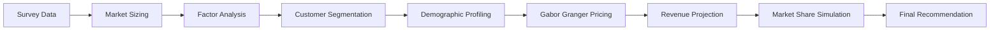

# Athena Game Acquisition & Pricing Analytics

A marketing intelligence capstone project for Athena Software focused on selecting the best game acquisition, identifying the optimal launch price, and defining the highest-value customer segments to target. The project combines customer segmentation, willingness-to-pay analysis, first-year profit modeling, and market share simulation to support a data-driven product portfolio decision.

## Project Objective

Athena Software is a premium PC RPG publisher evaluating which game to acquire and how to position it in the market.

This project answers two core business questions:

1. Which game should Athena pursue?
2. How should the selected game be priced for launch?

The analysis evaluates three acquisition candidates:

* Warrior Guild
* Seraph Guardians
* Evercrest

## Analysis Workflow



## Business Context

Athena specializes in premium role-playing games for PC players. The project estimates the addressable Steam-relevant market, segments customers based on psychographic preferences, measures willingness to pay for each candidate game, and compares financial and strategic outcomes across acquisition options.

The goal is not just to maximize projected profit, but to recommend a game that also fits Athena’s RPG positioning and performs well in the Steam market.

## Methodology

### 1. Market Sizing

The project begins by sizing the premium PC games market relevant to Athena’s category on Steam, using market assumptions for Steam’s share of the broader PC premium games segment.

### 2. Factor Analysis

Psychographic survey items were reduced into 11 interpretable factors, including themes such as:

* Strategy and Master Planning
* Anti-Completionism
* Non-Narrative
* Destruction Shooter Violence
* Anti-Exploration
* Anti-Action
* Non-Immersive
* Solo Preference
* Customization and Self Expression
* Competitive
* Anti-Challenge

These factors were used to simplify customer preference structure before segmentation.

### 3. Customer Segmentation

K-means clustering was used to identify five customer segments:

* Strategic Completers
* Casual Non-Strategists
* Passive Low-Engagement
* Narrative Avoiders
* Action Oriented Explorers

The segment profiles were then analyzed using gender, age, and income.

### 4. Pricing Analysis

A Gabor-Granger framework was used to estimate willingness to pay and identify the price that maximizes predicted revenue for each candidate game.

### 5. Financial Modeling

For each game, the project estimates:

* expected buyers
* gross revenue
* Steam platform fees
* royalty costs
* net revenue
* profit after acquisition and development costs

### 6. Market Share Simulation

The project simulates competitive market share under alternate release scenarios to estimate how each acquisition option performs relative to competing titles.

## Key Findings

### Customer Segments

Five distinct customer segments were identified, with meaningful differences in preferences, age, gender mix, and income.

The most commercially attractive segment across all three games was:

* Action Oriented Explorers

This segment was the oldest and highest-income group, making it especially valuable for premium game pricing and acquisition strategy.

### Optimal Prices

The recommended price points from the pricing analysis were:

* Warrior Guild: $35
* Seraph Guardians: $32
* Evercrest: $34

Seraph Guardians had the highest willingness to pay at 82.94 percent, making it the strongest pricing candidate from a demand perspective.

### First-Year Profit Projections

Estimated profit after all costs:

* Warrior Guild: $45.5M
* Seraph Guardians: $44.2M
* Evercrest: $42.0M

All three games were projected to be profitable.

### Market Share Results

In simulated competitive scenarios, Seraph Guardians achieved the strongest market share performance:

* 57.76 percent share when competing against the three confirmed competitors
* 50.05 percent share in the all-games scenario

This made it the strongest commercial choice from a market capture perspective.

## Final Recommendation

Athena should acquire Seraph Guardians.

Why this title was recommended:

* It achieved the highest simulated market share
* It delivered strong projected first-year profit
* It had the highest willingness to pay among the three games
* It aligned best with Athena’s premium single-player RPG positioning

### Recommended Launch Price

Seraph Guardians should be launched at:

* $32.00

This price produced the best revenue outcome in the Gabor-Granger analysis and matched the strongest willingness-to-pay signal.

### Recommended Target Segments

Primary audience:

* Action Oriented Explorers
* Strategic Completers

These segments showed the strongest willingness to pay and the best fit with the game’s strategy-oriented, progression-driven gameplay.

### Positioning Strategy

Recommended positioning should emphasize:

* strategic depth
* satisfying progression
* mastery and accomplishment
* rich single-player RPG experience

## Tools and Techniques

This project uses a notebook-based analytics workflow and applies:

* factor analysis
* PCA for dimensionality understanding
* K-means clustering
* demographic cross-tabulation
* regression and ANOVA
* Gabor-Granger pricing analysis
* first-year revenue modeling
* market share simulation

## Repository Structure

```text
athena-game-acquisition-pricing-analytics/
├── AthenaSW.ipynb                  # Main analysis notebook
├── Sriya_Capstone_Athena.pdf       # Final capstone report
├── data/
│   └── Athena_survey_data.csv      # Input survey dataset
└── README.md
```

## How to Run

1. Open the notebook in Jupyter Notebook, JupyterLab, or Google Colab

2. Make sure the survey dataset is available at the expected path

3. Run the notebook sections in order:
   * factor analysis
   * cluster analysis
   * demographic profiling
   * pricing analysis
   * revenue projections
   * market share simulation

4. Review the final recommendation outputs and visualizations

## Business Value

This project demonstrates how marketing analytics can support product strategy decisions by connecting customer preferences, price sensitivity, competition, and profitability into one decision framework.

It is especially relevant for:

* product strategy
* game publishing
* pricing analytics
* market segmentation
* go-to-market decision support

## Limitations

Key assumptions in the analysis include:

* equal pricing in some market share simulations
* one purchase per customer in the simulation model
* survey-based conversion assumptions for first-year revenue
* static competitive behavior

These assumptions make the model directionally useful, but real-world launch performance would still require post-launch testing and refinement.

## Future Improvements

Possible next steps:

* incorporate differentiated competitor pricing
* model multi-purchase customer behavior
* run sensitivity analysis on conversion assumptions
* build an interactive dashboard for scenario testing
* compare recommendations under alternate cost structures

## Author

Sriya Vemuri

## License

This project is intended for academic and portfolio use.
